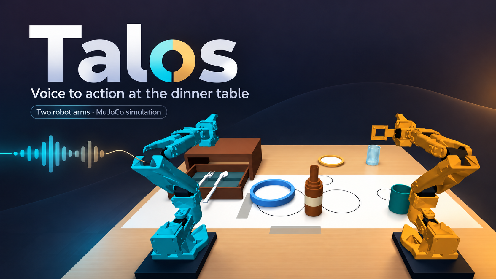

# Duet 2

Duet 2 starts from the supplied Talos source archive and will add original scene assets, interface changes, new randomized demonstrations, and evaluated policy improvements. Current status: baseline imported; runtime reproduction and new feature work are pending.

See [implementation plan](docs/DUET_IMPLEMENTATION_PLAN.md) and [progress tracker](docs/DUET_PROGRESS.md). The original project documentation follows. Its results, models, and recordings describe Talos, not newly measured Duet 2 results. Preserve upstream attribution and license notices.

## Original Talos documentation

**Voice to action at the dinner table.** Two SO-101 robot arms execute learned dinner-setting skills in a physical MuJoCo simulation.



[Try the live demo](https://huggingface.co/spaces/jannis-sms/talos-dinner-robotics) · [Presentation](submission/presentation.pdf) · [Results and limits](docs/EVIDENCE.md) · [Licenses and attribution](THIRD_PARTY_NOTICES.md)

Say or type **“Set the table.”** Talos places the bottle, plate and mug, opens the drawer, and retrieves the fork and spoon. It also transfers a bottle between the arms by setting it down on the shared table. The local app has six camera views, voice input, manual controls, cancellation and explicit failure messages.

This is a bounded simulation prototype. General object positions, unrestricted language, pouring, airborne handoffs and a complete randomized seven-item table remain unfinished. The cover is a stylized illustration; the demo and evaluation recordings show actual simulation.

## Run locally

Use Python 3.12 on Windows. No API key or NVIDIA GPU is needed for typed commands and CPU inference.

```powershell
git clone --depth 1 https://github.com/jannissio/talos-ai-infra.git
cd talos-ai-infra
py -3.12 -m venv .venv
.\.venv\Scripts\python -m pip install -r requirements.txt
.\start-lab.ps1 -Learned
```

In the browser, select **Dinner challenge**, **Task start**, **Closed** drawer and seed **42**. Select **Learned dinner · live mug vision**, reset, enter **Set the table**, and run. Reset before starting another complete trial. Voice is optional: copy `.env.example` to `.env`, privately add a Speechmatics key, then use **Speak instruction**.

[Setup and reproduction](docs/SETUP.md) covers Linux, GPU training, the hosted interface and verification. The Space starts a fresh isolated scene for each trial and offers one camera view. Its CPU option needs no account or GPU allocation; a full dinner can take about five minutes.

## What is verified

| Evaluation | Result | Scope |
| --- | --- | --- |
| Original six-skill dinner | 8/10 | Frozen narrow starting scenes; both failures retained |
| Bottle relays | 5/5 each direction | Table-supported transfer, four learned legs |
| Relay followed by dinner | 8/10 | A separate frozen left-reach preset |
| Late mug visual correction | 20/20 live; 20/20 original baseline; 0/20 frozen corrective images | Bounded visual feedback; no demonstrated gain over the original baseline on these scenes |
| Human voice rehearsal | All six skills completed | One exposed scene |
| Intel execution | Six-skill baseline on legacy Intel CPU/iGPU with UHD rendering | Core Ultra Series 2/3 eligibility is unresolved; the latest live-mug profile is not separately verified on Intel |

See [the evidence index](docs/EVIDENCE.md) for exact protocols, outcomes, limitations and archived traces. Neural models supply motion; an independent simulator-state monitor can stop or score it. Programmed control is a separate selectable mode using exact simulator state.

## Repository map

| Folder | Purpose |
| --- | --- |
| `simulation_lab/` | Browser server, physics, control, perception and robot assets |
| `models/` | Immutable checkpoints and exports; [model guide](models/INDEX.md) identifies the selected profile |
| `training/` | Compact inputs and frozen sources for the demonstrated models |
| `scripts/` | Reproduction, training and verification tools; [script guide](scripts/README.md) |
| `tests/`, `training_tests/` | Runtime contracts and model/geometry checks |
| `hosting/` | Compact Gradio Space |
| `docs/` | Setup, architecture and evidence |
| `submission/` | Current cover, presentation and submission text |

The release contains one current presentation. Historical slides, stopped experiments and complete success/failure traces are preserved in the [development archive](docs/ARCHIVE.md). A shallow clone avoids downloading that large history. Credentials, virtual environments, personal recordings and editing files are excluded from Git.

## Licenses and attribution

**MIT covers original Talos code, model weights and procedural dinner assets.** The root [MIT license](LICENSE) does not replace third-party terms. SO-101 robot assets retain [Apache-2.0](simulation_lab/assets/so101/LICENSE), their [source attribution and modification notices](simulation_lab/NOTICE.md). Installed libraries retain their own licenses, including Apache-2.0, BSD and MIT-CMU.

See [third-party notices and the dependency-license table](THIRD_PARTY_NOTICES.md) for the component boundaries, upstream links and archived research licenses.
